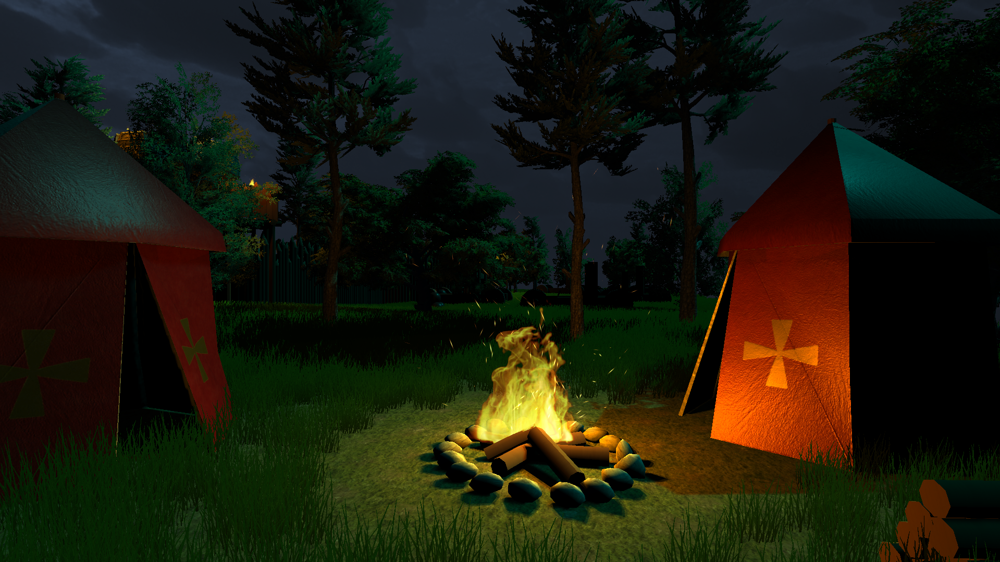
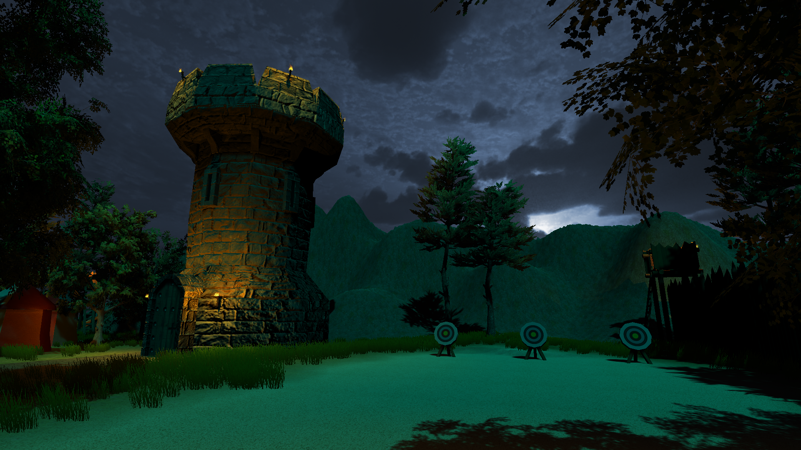
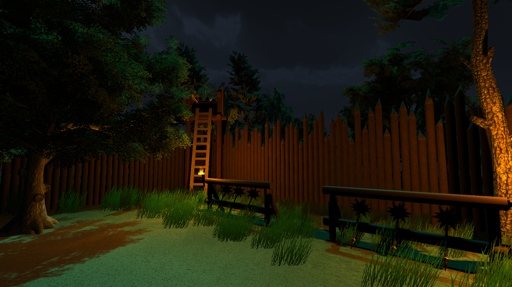
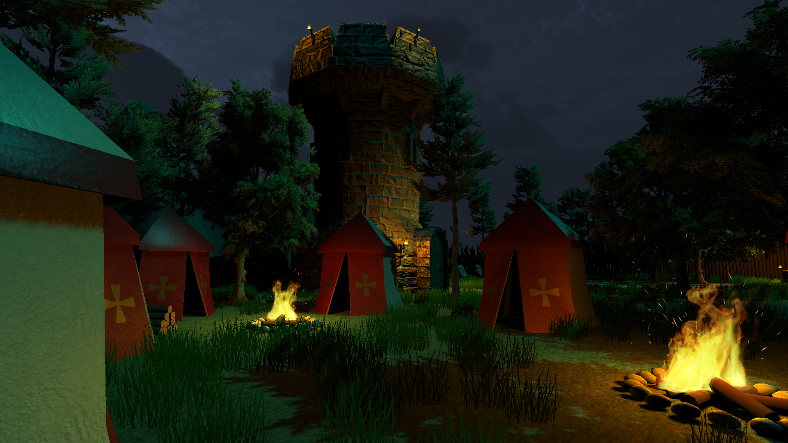
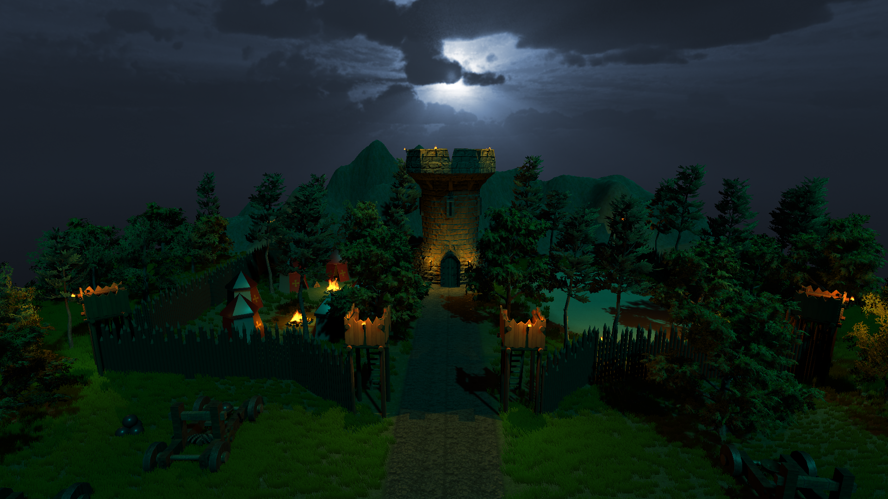
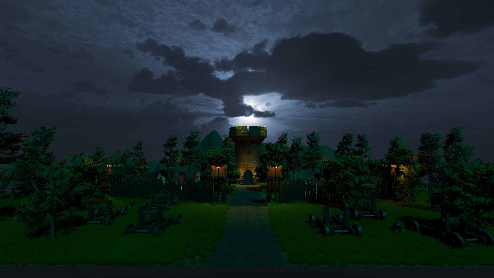

# Medieval-Camp
Medieval camp assets made with 3DSmax and Substance Painter in a playable unity 3D scene.

## Screenshots

## Instructions
Download the executable file: https://drive.google.com/file/d/1gx8u_g4NzJfmJB_fJg7fJ_XKQ-w68Ght

You can toggle between walk mode and free camera mode with the left shift.

## Concepts developed in this project:
- Modelling the different assets with 3DSmax.
- Applying quality textures with Substance Painter.
- Use Unity's terrain editor to give more atmosphere to the scene.
- Build a playable unity 3D scene with the assets made.
